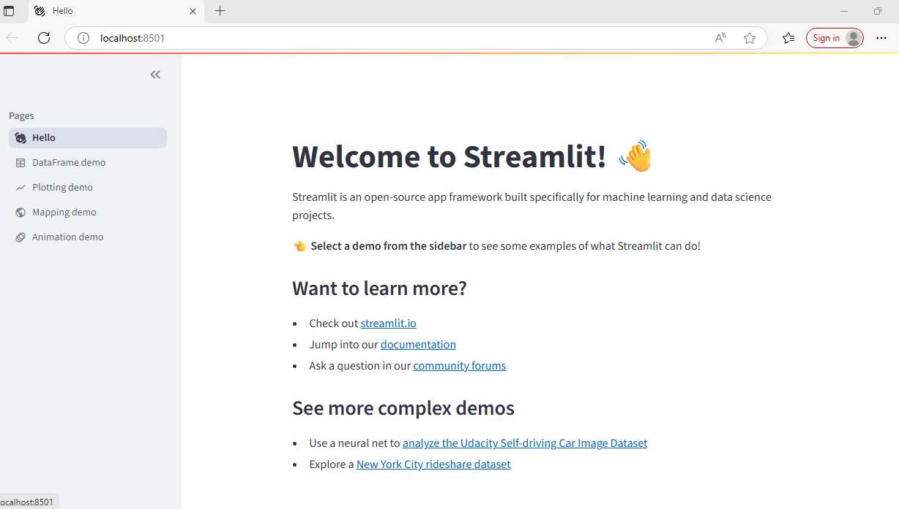

# Welcome to Streamlit 👋 <br>

### What is Streamlit? <br>

Streamlit lets you transform Python scripts into interactive web apps in minutes, instead of weeks. Build dashboards, generate reports, or create chat apps. Once you’ve created an app, you can use our Community Cloud platform to deploy, manage, and share your app. <br>

### Why choose Streamlit? <br>
**Simple and Pythonic:** Write beautiful, easy-to-read code.<br>
**Fast, interactive prototyping:** Let others interact with your data and provide feedback quickly.<br>
**Live editing:** See your app update instantly as you edit your script.<br>
**Open-source and free:** Join a vibrant community and contribute to Streamlit's future.<br>

### Installation <br>
<pre>

```bash 
pip install mypackage </pre>

```` ```bash ... ``` ````

If this opens our sweet Streamlit Hello app in your browser, you're all set! If not, head over to our docs for specific installs. <br>

The app features a bunch of examples of what you can do with Streamlit. Jump to the quickstart section to understand how that all works. <br>



